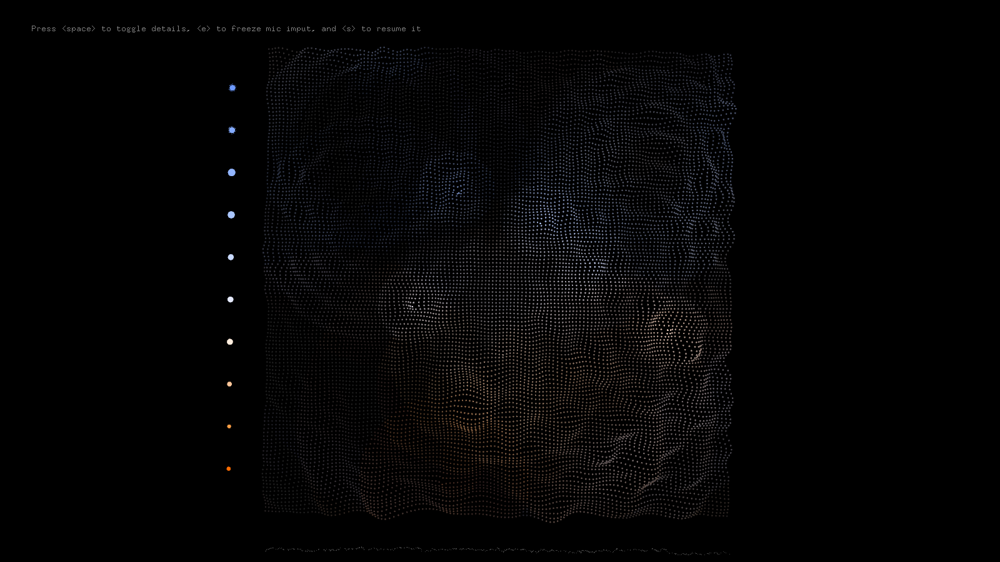
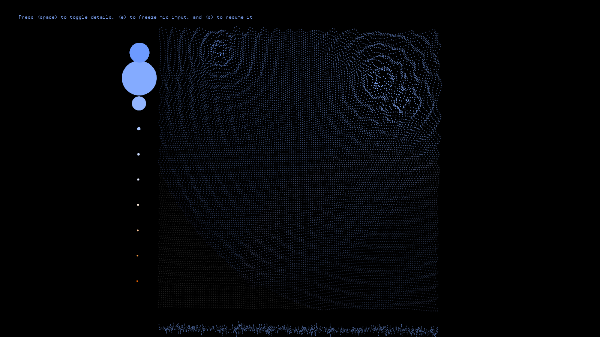
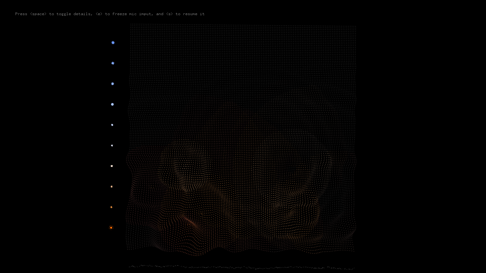

# Pond - A Zen audio visualizer

## To Build
1. Install OpenFrameworks with the ofxFft addon. You may also need to install fftw.
2. edit src/ofApp.cpp:14 to use the correct audio input device (remove to use default device)
3. edit config.make to point to your openframeworks installation
4. run `make`
    
## To use:
1. Run `./bin/hw2`
2. Press `space` to toggle detail display 
	Press `e` to pause the audio stream 
	Press `s` to resume the audio stream
3. Make noise!

## Description
This audio visualizer is intended to mimic the surface of a pond. Sounds create ripples on the surface like drops of water.

The y-position of each drop corresponds roughly to the octave of the sound that created it, and the x-position is totally random, as if controlled by nature.

Deep (low frequency) sounds create red ripples that oscillate slowly. Bright (high frequency) sounds create blue ripples that oscillate quickly.

## Ideas + Challenges
I wanted to create something that feels organic, something that arises from the interaction of many simple components. I got the idea to use small particles from watching the picture explosion demo in class. I experimented with moving lots of small dots around and found that moving the dots in waves produced a beautiful, fluid surface. From this, I decided to model my dots as the surface of a pond, perturbed by droplets of sound.

I added frequency-based coloring to help differentiate the droplets. The color is based on white-points with the color temperature matching the tone of the sound. Low frequencies = warm sound = warm light. High frequencies = cool sound = cool light.

I tried to map each distinct sound to its own drop, but found this to be too difficult and settled on mapping the power of each octave to its own drop.

I wanted to use sprites for each point and an openGL shader for their color, but I couldn't figure out how to make that work.

I also found that using a random position for each drop made the output too unpredictable, so I settled on leaving the drops' x-positions random, but mapping their y-axis to their octaves.

## More screenshots

